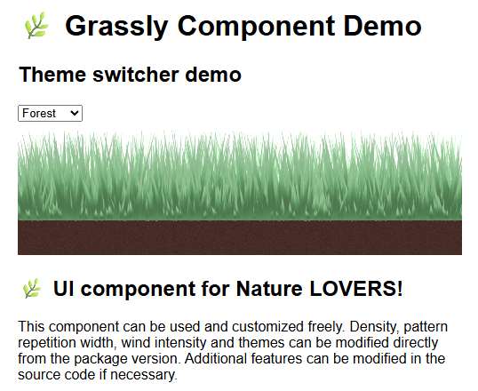

# Grassly

A lightweight Web Component for rendering animated interactive grass using Canvas and Lit.

## Overview
A cosmetic component for decorating your web pages with a corner of nature! The default customization options cover grass density, surface of the repeating pattern, wind intensity and colour themes. This component can be further customized by modifying the source files.

## Instalation
Clone the repository or download the source code available [here](https://github.com/GeanovuMedeea/Grassly/releases/tag/v1.0.0).

Or install from NPM:

`npm install @medeeageanovu/grassly-component`

## Usage
There are multiple ways to integrate grassly-component. 

For NPM, import the package in main.js:

`import '@medeeageanovu/grassly-component';`

For the bundles .js file, import the script in index.html:
````html
<script type="module" src="path/to/script/grassly-component.build.js"></script>
````
Then use as a usual html element:

```html
<grassly-component></grassly-component>
```
There are four customizable parameters:
````html
<grassly-component density="number" wind="number" tile="number" theme="string"></grassly-component>
````

## Documentation


## Demo


Available in the source code /dev folder is a simple playground to become familiar with the provided default options.

## Supported Languages

Currently, Grassly was tested on Lit, React, Vue and Vite.

## License
Permission is hereby granted to any person obtaining a copy of this software and associated documentation files to use, modify, merge, or distribute free of charge.