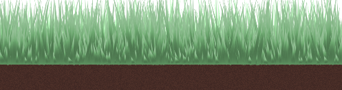
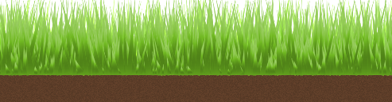
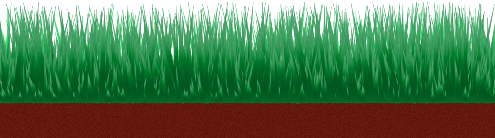
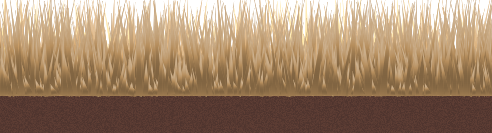
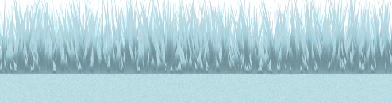
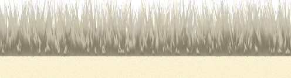
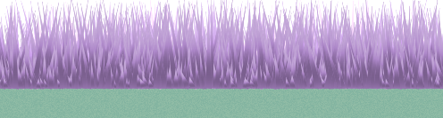
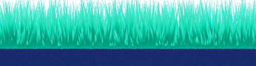

# Grassly

A lightweight Web Component for rendering animated interactive grass using Canvas and Lit.

## Overview
A cosmetic component for decorating your web pages with a corner of nature! The default customization options cover grass density, surface of the repeating pattern, wind intensity and colour themes. This component can be further customized by modifying the source files.

## Instalation
Clone the repository or download the source code available [here](https://github.com/GeanovuMedeea/Grassly/releases/tag/v1.0.0).

Or install from NPM:

`npm install @medeeageanovu/grassly-component`

## Usage
There are multiple ways to integrate grassly-component. 

For NPM, import the package in main.js:

`import '@medeeageanovu/grassly-component';`

For the bundles .js file, import the script in index.html:
````html
<script type="module" src="path/to/script/grassly-component.build.js"></script>
````
Then use as a usual html element:

```html
<grassly-component></grassly-component>
```
There are four customizable parameters:
````html
<grassly-component density="number" wind="number" tile="number" theme="string"></grassly-component>
````

## Documentation

The default parameters are:

| Property | Type   | Default | Description                                                    |
|----------|--------|---------|----------------------------------------------------------------|
| density  | number | 40      | number of grass blades distributed for the 1st, 2nd, 3rd layer |
| wind     | number | 1       | the intensity of the grass blades movement                     |
| tile     | number | 40      | grid spacing, length of repeating pattern                      |
| theme    | string | forest  | color theme. cute!                                             |

The avaiable themes are:

| Name   | Example |
|--------|--------|
| forest ||
| spring ||
| summer ||
| autumn ||
| winter ||
| desert ||
| lilac  ||
| neon   ||

## Demo


Available in the source code /dev folder is a simple playground to become familiar with the provided default options.

## Supported Languages

Currently, Grassly was tested on Lit, React, Vue.
### Lit
````html
<grassly-component density="40" wind="0.1" tile="25" theme="forest" ></grassly-component>
<script type="module" src="/src/main.js"></script>
````

### React

```javascript
import '@medeeageanovu/grassly-component';

export default function App() {
  return <grass-floor density="40" wind="0.1" tile="70" theme="autumn"></grass-floor>;
}
```
### Vue

```javascript
<script setup>
import '@medeeageanovu/grassly-component';
</script>

<template>
  <grassly-component density="10" wind="1" tile="20" theme="winter"/>
</template>
```

## Notes
Requires browser environment (Canvas API) and must add `lit` to package dependencies.

The program logic is explained in `/docs`.

## License
Permission is hereby granted to any person obtaining a copy of this software and associated documentation files to use, modify, merge, or distribute free of charge.